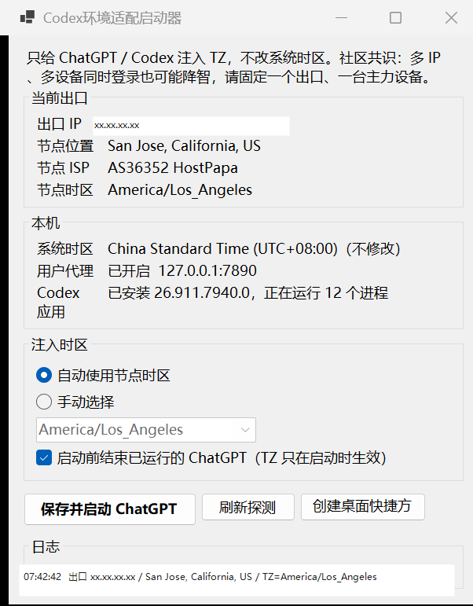
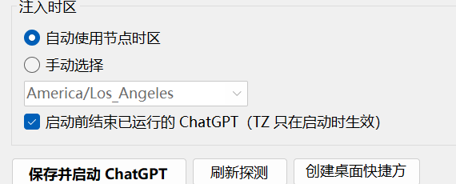

# Codex环境适配启动器

把 **ChatGPT / Codex 桌面端** 的运行环境，对齐到当前代理节点：

1. 网络出口走海外节点（例如圣何塞 VPS）
2. 进程时区使用该节点的 IANA 时区（例如 `America/Los_Angeles`）
3. **不修改** Windows 系统时区

## 社区共识（不是官方说明）

社区里把「回复质量突然变差、看起来像被换成低档模型」叫做 **降智**。下面几条是常见共识，**不是 OpenAI 官方机制**，也不能保证每个账号都一样。

| 诱因 | 社区观察 | 建议 |
|------|----------|------|
| 时区与出口 IP 不一致 | 系统还是中国时区，流量却从美国节点出去，桌面端容易隐性降智 | 用本启动器给 ChatGPT 注入节点时区，例如 `America/Los_Angeles` |
| **多 IP** | 同一账号短时间换国家/城市出口，或网页、APP、手机各走不同 IP | 固定 **一个** 出口地区；不要今天加州、明天东京、后天新加坡来回切 |
| **多设备同时登录** | 电脑桌面端、浏览器、手机 App 同时在线，也常被反馈会降智 | 同一时间尽量只在 **一台主力设备、一个客户端** 使用 |

本启动器只处理第一项（时区对齐出口）。多 IP 和多设备要靠使用习惯约束：

- 一个账号对应一个稳定出口
- 一个出口对应一个 IANA 时区
- 一台电脑作为主力，不要多端同时挂着
- 换节点后先刷新探测，再重新启动 ChatGPT

## 它做什么

| 项目 | 行为 |
|------|------|
| 出口探测 | 读取当前公网 IP、城市、国家、IANA 时区 |
| 代理检查 | 显示用户代理 / WinHTTP / 进程代理变量，不擅自改代理 |
| 时区注入 | 只给 ChatGPT 进程设置 `TZ` |
| 系统时区 | 保持原样，例如继续用中国标准时间 |

不下载、不运行第三方「时区启动器」exe。脚本都在 `scripts/` 里，可直接阅读。

## 各系统怎么适配

时区对不齐出口，在 macOS / Linux 上同样可能出现，但 **只有 Windows 值得做 exe**。

| 系统 | 做法 |
|------|------|
| Windows | 用本仓库 Release 里的桌面启动器 |
| macOS | 双击 `scripts/macos/Launch-Codex.command`，或跑 `scripts/unix/launch-codex.sh`。不要再做一个 .dmg |
| Linux | `scripts/unix/launch-codex.sh`；可选用 `scripts/linux/install-desktop-entry.sh` 做成菜单项 |
| 浏览器 | 时区插件，IANA 与节点一致 |
| 手机 | 不要做 App；不要和电脑同时登录 |

详见 [docs/平台说明.md](docs/平台说明.md)。

macOS / Linux 示例：

```bash
chmod +x scripts/unix/launch-codex.sh
./scripts/unix/launch-codex.sh            # 探测并启动桌面端
./scripts/unix/launch-codex.sh --show     # 只看出口和时区
./scripts/unix/launch-codex.sh --cli      # 给 Codex CLI 注入 TZ
TZ=America/Los_Angeles ./scripts/unix/launch-codex.sh --timezone America/Los_Angeles
```

## 快速开始（Windows）

到 **Releases** 下载免安装 exe（约 50 MB，自包含，不需要再装 .NET）：

https://github.com/StatXzy7/codex-env-adapter/releases/latest

下载 `CodexEnvAdapter-1.0.0-win-x64.exe` 后双击即可。第一次打开后可点 **创建桌面快捷方式**。

exe 放在 Release 附件里，不进 git 仓库。

1. 先打开 Clash / 系统代理，并固定到同一个节点
2. 点 **刷新探测**，确认出口城市和时区
3. 点 **保存并启动 ChatGPT**
4. 不要从开始菜单再开一次 ChatGPT，也不要同时开网页版 / 手机 App

## 界面示例

主窗口（出口 IP 已隐去，仅作参考）：



时区注入与启动按钮：



重新编译：

```powershell
.\build.ps1
```

PowerShell 脚本仍可用：

```powershell
powershell -NoProfile -ExecutionPolicy Bypass -File .\scripts\Show-CodexEnvironment.ps1
powershell -NoProfile -ExecutionPolicy Bypass -File .\scripts\Launch-ChatGPT.ps1
```

换节点后必须重新探测并重新启动 ChatGPT。`TZ` 只在进程启动时生效。

## 推荐使用方式

1. 打开 Clash / 系统代理，确认 GPT 相关流量走 **同一个** 目标节点。
2. 用启动器刷新探测，确认出口城市和时区符合预期。
3. 点 **保存并启动 ChatGPT**，不要从开始菜单直接开。
4. 浏览器访问 chatgpt.com 时，另外用时区插件把浏览器时区改成同一 IANA 名称，并且不要和桌面端同时挂着。

手动指定时区：

```powershell
powershell -NoProfile -ExecutionPolicy Bypass -File .\scripts\Launch-ChatGPT.ps1 -Timezone America/Los_Angeles
```

## 目录

```text
src/CodexEnvAdapter/             Codex环境适配启动器（WinForms）
dist/CodexEnvAdapter.exe         本地打包产物（不入库，请从 Release 下载）
build.ps1                        重新打包 exe
config/settings.example.json     配置示例
docs/原理.md                     为什么要对齐网络和时区
docs/平台说明.md                 Windows / macOS / Linux / 手机分别怎么做
docs/使用指南.md                 日常操作与排错
scripts/CodexEnv.psm1            PowerShell 版探测 / 启动模块
scripts/unix/launch-codex.sh     macOS / Linux 启动脚本
scripts/macos/Launch-Codex.command
scripts/linux/install-desktop-entry.sh
scripts/Show-CodexEnvironment.ps1
scripts/Launch-ChatGPT.ps1
```

运行后的最近一次探测结果写在：

`%LOCALAPPDATA%\CodexEnvAdapter\settings.json`

## 和代理的关系

本仓库不管怎么搭代理，只负责：

- 确认 **现在** 的出口是哪
- 把 ChatGPT 桌面端的 `TZ` 对齐到这个出口

示例环境（与截图一致，不含真实 IP）：

- 出口：美国加州圣何塞，时区 `America/Los_Angeles`
- Windows 时区：`China Standard Time`（未改）
- ChatGPT 包：`OpenAI.Codex`，启动文件为 `app\ChatGPT.exe`
